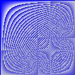

# GO coding examples from the Go language tour page

## Created by Morgan Schneider

### Purpose

This section of my Github Public directory is a space to demonstrate my answers to the coding exercises from the [Go language tour](https://tour.golang.org/list). Each exercise will contain a link to the relevant page from the tour as well as any explanation for non-functionality should the code be downloaded and compiled independently.

A note before beginning, as Go compiles all files in the same package and requires that only one main function be present, I created the main.go file to contain the main function for all my examples. This file contains the names of the functions to be executed based on the exercise that I am currently working on. You can change this by editing the file in question to change the *main_exercise_name* function in the file to just *main*

### Examples

#### Exercise 1: Loops and functions

The purpose of this exercise was to create a loop that calculated the value of a square root to a developer-specified value, first using a repeating loop and then to a certain degree of certainty using a method of our choosing. 

The page for this exercise can be found [here.](https://tour.golang.org/flowcontrol/8)

The first method was to use a for loop with 10 iterations to calculate the value of the square root. This can be seen below:

    for i := 1; i <= 10; i++ {
		z = z - (z*z-x)/(2*z)
	}

This line is commented in the file to prevent it from running concurrently with the second method, which uses a defined accuracy value to determine when the difference between the old and new value for the square root is small enough to break the loop.

    diff := 0.0000001

	for {
		z = z - (z*z-x)/(2*z)
		fmt.Println(z)
		if (z*z-x)/(2*z) < diff {
			break
		}
	}

#### Exercise 2: Slices

The purpose of this exercise was to create a process that calculated the value for each element in a slice of slices object. Link to the exercise is [here.](https://tour.golang.org/moretypes/18)

It should be noted that this code will not function independently from the tour website as the exercise requires the importation of the pic package

    import "golang.org/x/tour/pic"

As such, to verify the code works, you must copy the code to the webpage listed above. The resulting image from the code is shown below.

#### Exercise 3: Maps

The objective of this exercise was to create a function that would parse a string and keep count of the number of unique words located in the input. Link to the exercise is [here.](https://tour.golang.org/moretypes/23)

As with exercise 2, the code will not run independently of the website due to the need for the wc package. The function works by first parsing the text using the strings.Fields method and then mapping each word to a unique location in a map, incrementing the value in the map if it already exists or creating a new map entry if not.

#### Exercise 4: Fibonacci closure

The objective of this exercise was to create a function that would calculate the Fibonacci values to a user specified point using a closure. Link to the execise is [here.](https://tour.golang.org/moretypes/26)

This code will work outside of the website as it does not require any specific packages to function.  

#### Exercise 5: Stringers

The objective of this exercise was to a Stringer function for the IPAddr type that would return the values of an IP address as a string rather than a 4 byte array. Link to the execise is [here.](https://tour.golang.org/methods/18)

This exercise was fairly straightforward as this merely required parsing the input array using the sprintf function as seen below.

   func (p IPAddr) String() string {
       return fmt.Sprintf("%v.%v.%v.%v", p[0], p[1], p[2], p[3])
       }

No major complications encountered in this exercise.

#### Exercise 6: Errors

The objective of this exercise was to implement error handling in case a negative number was introduced into the sqrt function developed in exercise 1. Link to the exercise is [here.](https://tour.golang.org/methods/20)

As a general remark, I have to say that this portion of the tour of Go was really not well explained. I had to dig through a lot of additional references before I was able to get a handle on the error concept. Also, I am aware that this could have been handled using a function call to the previous sqrt function located in exercise 1 when run in an offline environment. However, I wanted to be certain that the code functioned inside the tour website so I implemented the sqrt_2 function in this file.

    func Sqrt_2(x float64) (float64, error) {

#### Exercise 7: Readers

The objective of this exercise was to create a reader interface that replaced all text read by the reader with the character "A".  Link to the exercise is [here.](https://tour.golang.org/methods/22)

I have few comments on this exercise itself as it is fairly straight forward. The only obstacle I faced was understanding again what the exercise wanted as an output. According to the exercise, the desired result was as follows:

> Implement a Reader type that emits an infinite stream of the ASCII character 'A'.

I initially interpreted this direction as creating a reader that printed an infinite number of 'A" characters, which made no sense as a reader function. Further investigation revealed that the exercise wanted what is described in the first paragraph.

#### Exercise 8: ROT13Reader

The objective of this exercise was to create a reader that took another reader as input and applied an ROT13 cipher to the characters. Link to the execise is [here.](https://tour.golang.org/methods/23)

This was one of the more challenging exercises I had encountered to date. My greatest challenge was figuring out how to actually access the value of the first reader that was being read by the rot13reader. I had to perform additional research to find out that the code required an additional de-reference to access the ascii character stored in the initial reader as seen below:

	n, err := z.r.Read(p)

Once I figured that step out, the rest was a fairly trivial job of implementing a switch that checked the character value and made the appropriate change as seen [here](https://en.wikipedia.org/wiki/ROT13).

#### Exercise 9: Image interface

The objective of this exercise was to create the interfaces needed to generate an image similar to the one created in [exercise 2](#2-Exercise-2:-Slices)Link to the exercise is [here.](https://tour.golang.org/methods/25)

Note that this code will not work apart from the Go tour page as it requires the pic import to function correctly. The results of the code presented are below.

To recreate the image seen in exercise 2, replace 128 in the Image definition with 256.

My biggest challenge with this code was implementing the color method. I kept receiving the following errors and was stuck for a while trying to figure out the issue:

	./prog.go:12:29: undefined: color
	./prog.go:14:9: undefined: color
	./prog.go:22:29: undefined: color
	./prog.go:26:9: undefined: color

I initially believed that the color method was imported with the image import. However, after a long time of the above errors, further research lead me to realize that a separate import was required for the color method to be implemented properly.

	import "image"
	import "image/color"
